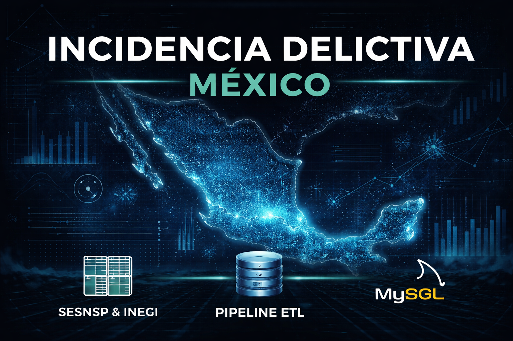
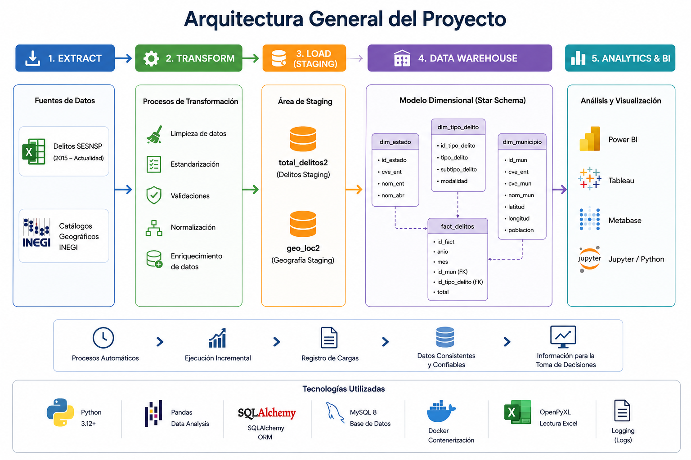
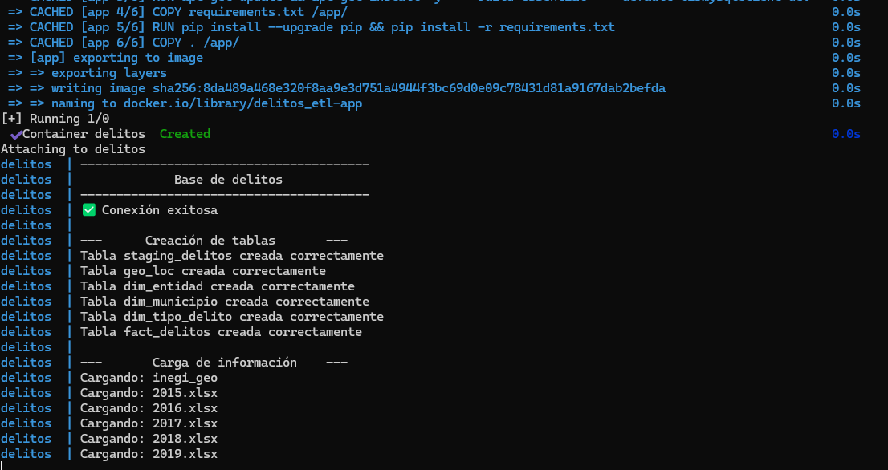
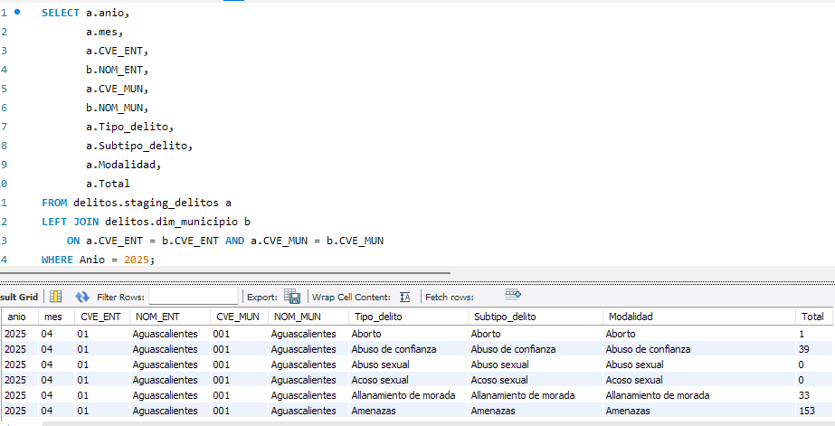

[](https://skillicons.dev)

# 📁 **Project : Incidencia delictiva en México**




# Descripción

Delitos ETL es un proyecto de ingeniería de datos desarrollado en Python para la extracción, transformación y carga (ETL) de información de incidencia delictiva municipal en México.

El proyecto integra datos históricos del Secretariado Ejecutivo del Sistema Nacional de Seguridad Pública (SESNSP) y datos geográficos del INEGI para construir un modelo dimensional tipo Star Schema en MySQL.

La solución permite automatizar el procesamiento de múltiples archivos históricos, generar dimensiones analíticas y poblar tablas de hechos optimizadas para herramientas de Business Intelligence como Power BI, Tableau, Metabase o Apache Superset.

# Objetivos
- Automatizar la carga de información histórica de delitos.
- Integrar información geográfica municipal proveniente de INEGI.
- Implementar un proceso ETL reproducible y escalable.
- Construir un modelo dimensional para análisis estadístico y visualización.
- Facilitar el análisis espacial y temporal de la incidencia delictiva en México.

# Requerimientos:
- [Python 3.12.0](https://www.python.org/)
- [MySQL](https://dev.mysql.com/downloads/workbench/)
- [Git](https://git-scm.com/)
- [Docker](https://www.docker.com/)
- [VScode](https://code.visualstudio.com/)

# Requerimientos:
- [Python 3.12.0](https://www.python.org/)
- [MySQL](https://dev.mysql.com/downloads/workbench/)
- [Git](https://git-scm.com/)
- [Docker](https://www.docker.com/)
- [VScode](https://code.visualstudio.com/)

# Flujo 
- Extracción de archivos históricos.
- Transformación y limpieza de datos.
- Carga en tablas staging.
- Actualización de dimensiones.
- Poblamiento de la tabla de hechos.
- Actualización incremental mediante claves únicas.
- Registro de cargas y auditoría.



 
# Estructura del Proyecto

El proyecto está estructurado de la siguiente manera:
 
    delitos_etl/
      │
      ├── config/                           # Configuración general del proyecto
      │   └── settings.py                   # configuraciones generales, 
      ├── data/                             # Datos crudos, procesados y temporales
      │   ├── raw/                          # archivos Excel originales
      │       └── Municipal_Delitos         # archivos de la SESNSP
      │   ├── AGEEML_2023311323291          # archivos INEGI
      ├── docs/                             # documentación del proyecto
      ├── figures/                          # Imágenes y visualizaciones exportadas
      ├── logs/                             # Logs de ejecución y monitoreo
      │   └── etl.txt
      ├── notebooks/                        # Jupyter notebooks para análisis y exploración
      ├── sql/                              # Scripts SQL, queries y creación de tablas
      ├── orquestation/                     # Flujos de orquestación        
      │   └── delitos_dag.py
      ├── src/                              # Código fuente principal del proyecto
      │   ├── database/
      │   │   ├── create_staging.py         # crea tablas staging
      │   │   ├── create_star_model.py      # tablas star schema
      │   │   └── mysql_client.py           # coneción a MySQL
      │   ├── extract/                      # extrae los datos de archivos fuente
      │   │   └── extractor.py
      │   ├── load/                         # carga a base de datos 
      │   │   ├── create_dw.py              # carga información al star schema
      │   │   ├── load_dimensions.py        # carga dimensiones
      │   │   ├── load_fact.py              # carga tabla de hechos
      │   │   └── loader.py                 # carga a base de datos
      │   ├── transform/                    # Limpieza y transformación de datos
      │   │   └── transformer.py            # Transformación de datos antes de la carga a base de datos
      │   ├── pipelines/                    # Pipeline principal de procesamiento
      │   │   └── run_pipeline.py           # Ejecuta el todo el proceso 
      │   └── utils.py                      # Funciones auxiliares y utilidades
      │       └── getFilenames.py     
      │
      ├── .env                              # Variables de entorno
      ├── main.py                           # Punto de entrada principal del proyecto
      ├── Dockerfile                        # Imagen Docker de la aplicación
      ├── Docke-compose.yml                 # Orquestación de contenedores Docker
      ├── Readme.md                         # Documentación principal
      └── requirements.txt                  # Dependencias Python


# Intalación de Python y otras dependencias
 
Descargar e instalas todas herramientas en requerimientos.

# Clonar el proyecto a una carpeta en escritorio
 
- Crear una carpeta en escritorio p.e. "FinancialMarkets" <break> 
- Click derecho en cualquier lugar dentro de la carpeta y seleccionar **"Git Bash Here"** <break> 
- En la consola de Git ingtroducir siguiente comandos: <break> 
  ```bash
  git clone https://github.com/JulioCesarMS/Incidencia_delictiva_nacional.git

  cd delitos_etl
  ```
  - Esperar unos minutos a que descargue los archivos en la carpeta
  

# Crear archivo `.env`

Crear en MySQL una conexión, con usuario, y contraseña, posteriormente una base llamada "financialmarkets". Con esa información  crear un archivo `.env` en la raíz del proyecto:

```env
DB_HOST=host.docker.internal
DB_PORT=3306
DB_NAME=delitos
DB_USER= usuario raíz en MySQL
DB_PASSWORD= contraseña para acceder a la conexión en MySQL
```
 
# Creación de ambiente virtual

 Es recomendable crear un ambiente virtual para fijar la versión de python, así como las dependencias instaladas.

Crear entorno virtual:

```bash
python -m venv venv
```

Activar entorno:

En Windows

```bash
venv\Scripts\activate
```


# Construir y ejecutar Docker

Ejecutar el siguiente comando:

```bash
docker compose up --build
```



Este comando:
- Construye la imagen Docker
- Levanta el contenedor
- Ejecuta automáticamente el pipeline principal

para detener el contenedor:
```bash
docker compose down
```

ver logs del contenedor: 
```bash
docker compose logs -f
```

# Orquestación con Prefect

El proyecto utiliza Prefect para automatizar la ejecución de pipelines.

Ejecutar deployment:

```bash
python orchestration/deploy.py
```


# Consultas

Una vez cargada la información se pueden realizar consultas





# Posibles Análisis

- .
- Delitos por entidad federativa.
- Mapas de calor geográficos.
- .
- Análisis espacial utilizando coordenadas geográficas.


